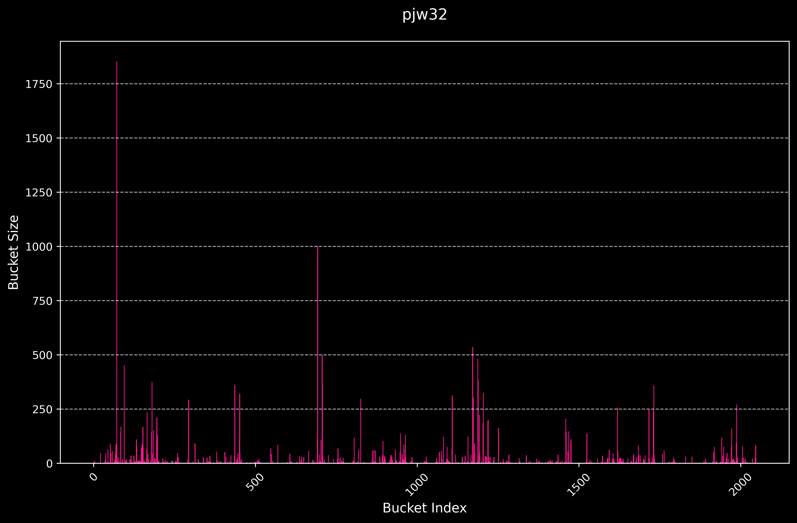
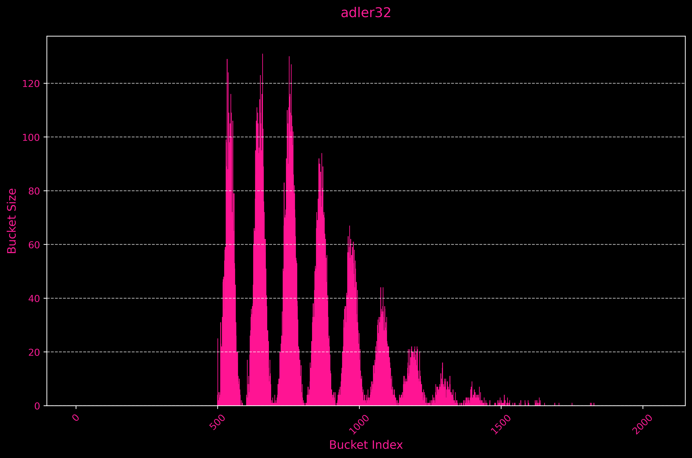
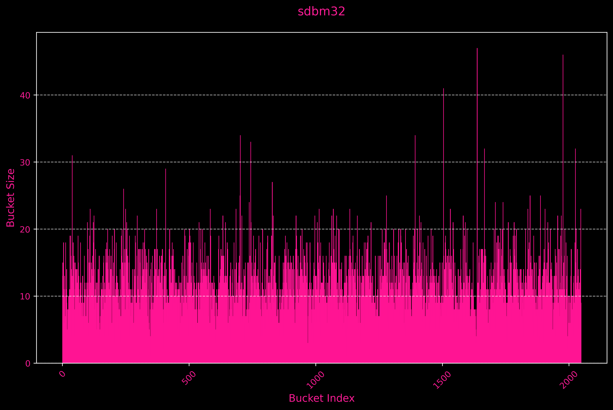
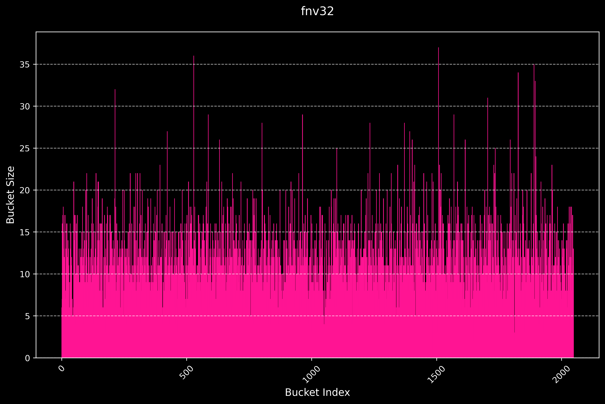
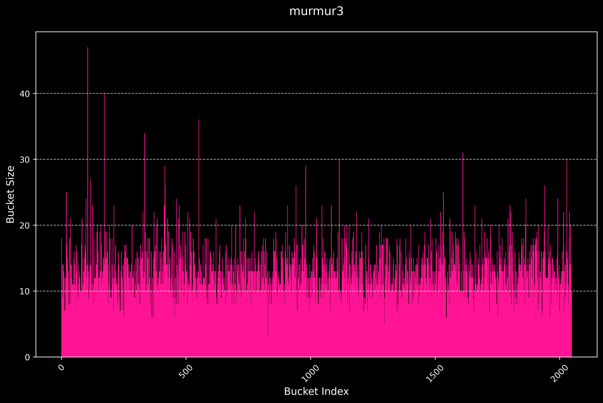
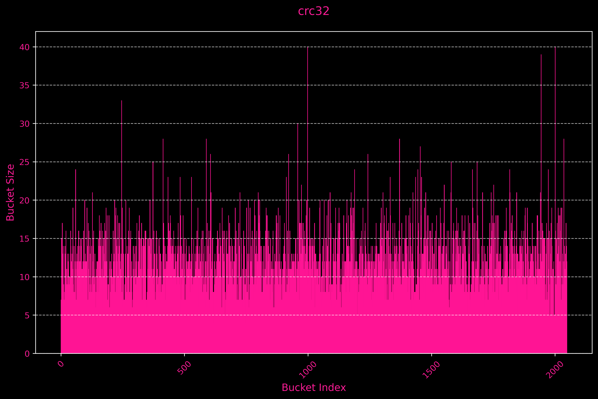

# HashTable

---

`MAX_LOAD_FACTOR = 15`

  

`Dispersion: 3769.2957`

---

  

`Dispersion: 587.0115`

---

  

`Dispersion: 20.7059`

---

  

`Dispersion: 18.1092`

---

  

`Dispersion: 17.6561`

---

  

`Dispersion: 17.0106`

---