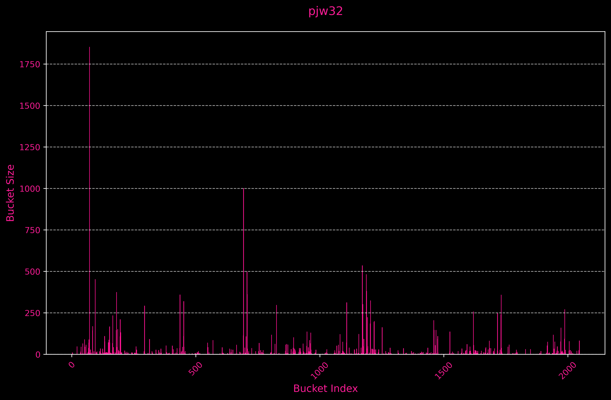
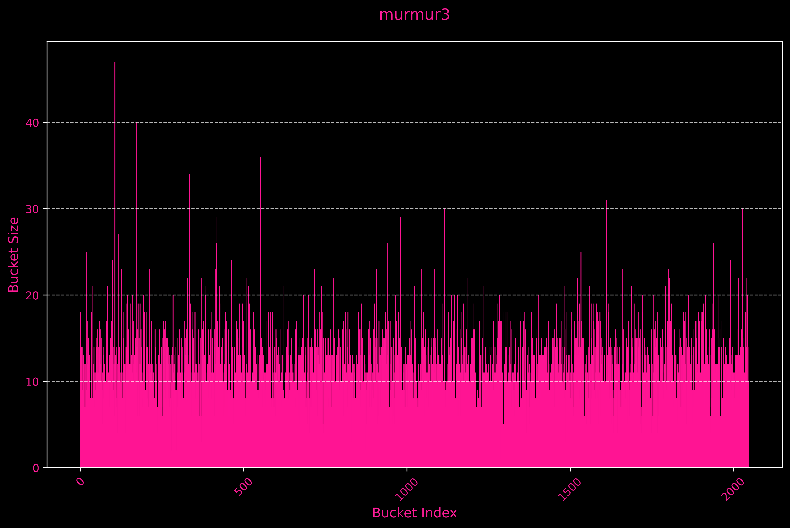

# HashTable

---

<p align="center">
  <a href="" rel="noopener">
 </a>
</p>

---

---

`MAX_LOAD_FACTOR = 15`

<p align="center">
  <a href="" rel="noopener">
 </a>
</p>

`Dispersion: 3769.2957`

---

<p align="center">
  <a href="" rel="noopener">
 </a>
</p>

`Dispersion: 587.0115`

---

<p align="center">
  <a href="" rel="noopener">
 </a>
</p>

`Dispersion: 20.7059`

---

<p align="center">
  <a href="" rel="noopener">
 </a>
</p>

`Dispersion: 18.1092`

---

<p align="center">
  <a href="" rel="noopener">
 </a>
</p>

`Dispersion: 17.6561`

---

<p align="center">
  <a href="" rel="noopener">
 </a>
</p>

`Dispersion: 17.0106`

---

```shell
Hash Function   : Time (in ticks):
-------------------------------------------------
pjw32           : 126090467
adler32         : 41796669
sdbm32          : 24186291
fnv32           : 25276647
murmur3         : 25542512
crc32           : 29965441
-------------------------------------------------
```